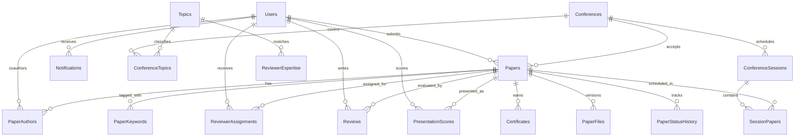

# DBMS Showcase Plan for ConferMS

This project now keeps the original React/Node/MySQL app intact and adds a DBMS showcase layer through:

- `sql/dbms_showcase.sql`: normalized extension schema, indexes, views, triggers, functions, procedures, cursor procedure, transaction routines, audit/recovery tables, distributed metadata, and warehouse snapshots.
- `sql/dbms_lab_queries.sql`: ready-made SQL examples for SELECT, joins, subqueries, set operations, functions, views, transactions, EXPLAIN, and DCL references.
- `mongodb/cms_mongodb_showcase.js`: MongoDB CRUD, criteria queries, type-specific queries, aggregation, and MapReduce-style lab coverage.
- `/api/nosql/analytics`: Admin-only backend route that stores SQL OLAP metrics as MongoDB documents for the Admin Dashboard.

## How to Run

```bash
mysql -u root -p < schema.sql
mysql -u root -p cms_db < sql/dbms_showcase.sql
mysql -u root -p cms_db < sql/dbms_lab_queries.sql
```

For MongoDB:

```bash
mongosh mongodb/cms_mongodb_showcase.js
```

For the live app integration, run MongoDB locally and keep these backend `.env` values:

```env
MONGO_URI=mongodb://127.0.0.1:27017
MONGO_DB_NAME=cms_nosql_showcase
```

The app remains usable if MongoDB is stopped; the Admin Dashboard shows a fallback message and reads the same analytics directly from MySQL.

## ER Diagram



## Syllabus Coverage Map

| Syllabus concept | ConferMS implementation |
|---|---|
| Need of DBMS | Multi-role system with centralized conference, paper, review, certificate, and notification data. |
| Database architecture | Frontend, Express API, MySQL OLTP database, optional MongoDB NoSQL demo, warehouse snapshot table. |
| ER model | Users, Conferences, Papers, Reviews, Certificates, Topics, Sessions, Sites, and many-to-many bridge tables. |
| Keys | Primary keys, foreign keys, composite keys, unique keys such as `ReviewerAssignments(paper_id, reviewer_id)`. |
| Extended ER | User role specialization, topic hierarchy, committee roles, paper authorship, reviewer expertise. |
| Relational model | All operational data represented as normalized relations with constraints and referential integrity. |
| Codd's rules | SQL relations, declarative querying, views, integrity constraints, and logical data independence through views. |
| Normalization | `PaperAuthors`, `PaperKeywords`, `ConferenceTopics`, `ReviewCriteriaScores`, and session tables remove repeating groups and multivalued attributes. |
| Functional dependencies | Examples: `paper_id -> title, conference_id, status`; `(paper_id, reviewer_id) -> review scores`; `(conference_id, topic_id) -> is_primary`. |
| 1NF, 2NF, 3NF, BCNF | Atomic rows and bridge tables avoid partial/transitive dependencies in the showcase schema. |
| 4NF and MVD | Authors, keywords, and topics are separated from `Papers` and `Conferences` to avoid independent multivalued facts in one table. |
| 5NF | Session scheduling uses `ConferenceSessions` and `SessionPapers` so valid joins reconstruct presentation schedules. |
| DDL | `CREATE TABLE`, `CREATE VIEW`, `CREATE INDEX`, `CREATE TRIGGER`, `CREATE PROCEDURE`, `CREATE FUNCTION`. |
| DML | Inserts, updates, deletes, and transaction-safe updates in the lab query file and procedures. |
| SELECT operators | `WHERE`, `LIKE`, `IN`, `BETWEEN`, `IS NULL`, ordering, grouping, aggregate functions, and set queries. |
| Joins | Equijoin, non-equijoin, self join, left outer join examples in `dbms_lab_queries.sql`. |
| Nested queries | Single-row, multiple-row, correlated, `EXISTS`, `ANY`, `ALL`, and DML-with-subquery examples. |
| DCL | Role and grant examples are included as privileged DBA comments. |
| TCL and ACID | `START TRANSACTION`, `COMMIT`, `ROLLBACK`, `FOR UPDATE`, and transactional procedures. |
| Procedures | `sp_assign_reviewer_atomic`, `sp_submit_review_atomic`, `sp_make_paper_decision_atomic`, `sp_refresh_conference_metric_snapshots`. |
| Functions | `fn_paper_review_average`, `fn_days_until_deadline`, `fn_acceptance_band`, `fn_final_weighted_score`. |
| Triggers | Review score recalculation, presentation validation, paper status history, file version tracking, certificate validation, audit logging. |
| Cursors | `sp_reviewer_workload_cursor` loops over reviewers and returns pending/completed workload. |
| Views | Catalog, review summary, workload, author history, accepted paper ranking, OLAP metrics, updatable and non-updatable view examples. |
| Indexing | Composite indexes, unique indexes, and full-text index on `Papers(title, abstract, keywords)`. |
| Query processing and optimization | `EXPLAIN` examples and indexed workload queries. |
| Transactions and schedules | Atomic review assignment/review/decision procedures demonstrate serializable units of work and locking. |
| Concurrency control | `SELECT ... FOR UPDATE` locks critical paper rows while assigning reviewers or deciding results. |
| Recovery | `PaperStatusHistory`, `PaperFiles`, `AuditLog`, and metric snapshots create traceability and recovery evidence. |
| Distributed databases | `Sites`, `ConferenceSites`, and `ReplicationLog` model replicated/read/analytics sites and fragments. |
| Security | Role-based backend auth plus SQL DCL role examples and audit logging. |
| NoSQL | MongoDB conference and paper-event documents with embedded arrays and nested objects. |
| BASE and CAP | MongoDB script uses denormalized documents suitable for eventual-read analytics; distributed site metadata supports CAP discussion. |
| Big data and MapReduce | MongoDB aggregation and MapReduce count papers by conference. |
| Data warehouse | `ConferenceMetricSnapshots`, `vw_conference_metrics_olap`, and `vw_data_warehouse_fact_paper`. |
| OLTP vs OLAP | Existing app tables support transactions; OLAP views/snapshots support reporting. |

## Demo Flow

1. Show the ER/modeling side with `schema.sql` plus the normalized bridge tables in `sql/dbms_showcase.sql`.
2. Run `SELECT * FROM vw_paper_review_summary;` and `SELECT * FROM vw_reviewer_workload;` to demonstrate views and joins.
3. Use `CALL sp_reviewer_workload_cursor(NULL);` to demonstrate cursors.
4. Use `EXPLAIN` queries from `sql/dbms_lab_queries.sql` to discuss indexing and optimization.
5. Show `PaperStatusHistory` and `AuditLog` after inserting/updating papers to demonstrate triggers and recovery.
6. Show `ConferenceMetricSnapshots` and OLAP views for warehouse/reporting discussion.
7. Run the MongoDB script for the NoSQL, aggregation, and MapReduce section.

## Normalization and FD Talking Points

Use these during viva to explain design choices:

| Relation | Main functional dependencies | Candidate key / note |
|---|---|---|
| `Users` | `id -> name, email, password, role, institution`; `email -> id, name, role` | `id`, `email` |
| `Conferences` | `id -> title, venue, status, submission_deadline, created_by` | `id` |
| `Papers` | `id -> title, abstract, author_id, conference_id, status, version`; `(author_id, conference_id, title) -> id` can be treated as a business key if enforced | `id` |
| `ReviewerAssignments` | `(paper_id, reviewer_id) -> assigned_date` | composite key behavior through unique assignment |
| `Reviews` | `(paper_id, reviewer_id) -> originality_score, technical_quality_score, clarity_score, relevance_score, total_score` | unique reviewer review per paper |
| `PaperAuthors` | `(paper_id, user_id) -> author_order, is_corresponding`; `(paper_id, author_order) -> user_id` | resolves multi-author MVD |
| `ConferenceTopics` | `(conference_id, topic_id) -> is_primary` | resolves multi-topic MVD |

Example closure:

```text
Given F = {
  paper_id -> title, author_id, conference_id, status,
  author_id -> author_name,
  conference_id -> conference_title
}

paper_id+ = {
  paper_id, title, author_id, conference_id, status,
  author_name, conference_title
}
```

Example minimal cover idea:

```text
Original FD:
paper_id -> title, author_id, conference_id, status

Minimal-cover style split:
paper_id -> title
paper_id -> author_id
paper_id -> conference_id
paper_id -> status
```

Decomposition property example:

```text
Papers(id, title, author_id, conference_id, keywords)
decomposes into:
Papers(id, title, author_id, conference_id)
PaperKeywords(paper_id, keyword)

Lossless join: Papers.id = PaperKeywords.paper_id
Dependency preservation: paper details remain in Papers, independent keyword facts move to PaperKeywords.
```

## Notes

- The main application can continue using the original tables and API code.
- The showcase script adds stricter database-level rules. For example, reviews require reviewer assignments, certificates require accepted papers, and presentation scores require coordinator users.
- MySQL is used as the SQL dialect. The syllabus says PL/SQL, so the equivalent MySQL stored procedures, functions, triggers, and cursors are implemented.
